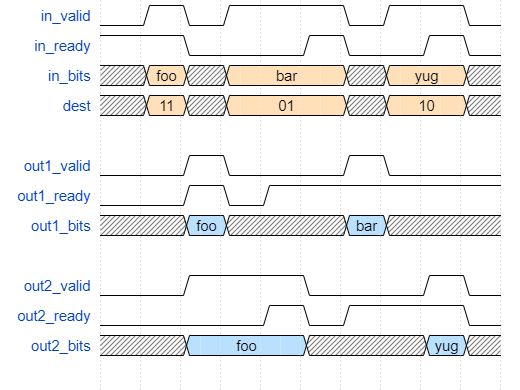

Exercise 2
==========

The objective of exercise 2 is to create your first library component.  This block is called Decoupled, 
and it accepts data from a single input interface and replicates the data across multiple output interfaces,
using the input port *dest* to control which interfaces receive the replicated data.

The waveform below shows three sample transactions for a two-output distributor implementation.

The first transaction is sent to both output ports, each of which complete the request at different times.
Your distributor implementation should be permissive, so should not require that output ports assert
ready at the same time.

The second and third transactions are sent only to one of the two output ports, demonstrating how the
dest control port selectively replicates data.  The non-selected interface ports do not receive valid
signals, and therefore should ignore their *bits* input ports.

